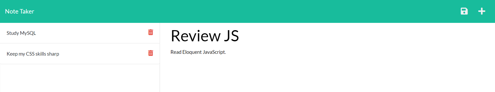

# Note-Taker
  
  [Note Taker Web App](https://gentle-spire-47996.herokuapp.com/)
  
  ## Table Of Contents
  + [Description](#description)
  + [Installation Instructions](#installation-instructions)
  + [License](#license)
  + [Usage Information](#usage-information)
  + [Contribution Guidelines](#contribution-guidelines)
  + [Test Instructions](#test-instructions)
  + [Questions](#questions)
  ## Description
  This Note Taker app allows users to quickly write, reference, and save notes all in one place. A note may be added after adding a title and text by clicking the save icon in the top right corner. To delete a saved note, simply click on the delete button / trash icon for the specific note on the left sidebar. This application was built using primarily Express.js.
  ## Installation Instructions
  [Click here to launch the website deployed to Heroku.](https://gentle-spire-47996.herokuapp.com/) Otherwise, clone down the repo and run the app locally. 
  ## License 
    
  This project is protected under the MIT license.  
  To understand what you can and cannot do with this project, please refer to the MIT documentation at [MIT Licensing](https://opensource.org/licenses/MIT).
  ## Usage Information
  You may the application at your own disposal for non-commercial reasons. 

  ---

  ## Contribution Guidelines
  To contribute to this application, please fork the project and submit a pull request. 
  ## Test Instructions
  N/A
  ## Questions
  If you have any questions, feel free to reach out to me.  
  GitHub: https://github.com/TDEvans97  
  Email: tylerdevansmusic@gmail.com